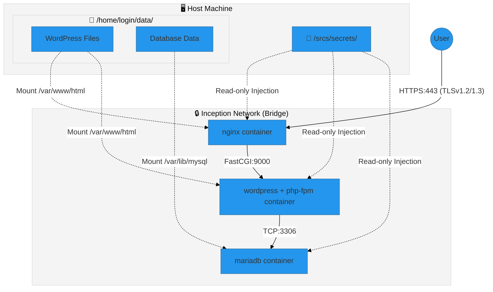

<div align="center">

# 🐳 Inception - Dockerized Infrastructure


<br />



<br />

<p align="center">
  <strong>A System Administration project building a highly isolated infrastructure using Docker Compose.</strong><br>
  Features custom-built images, strict security protocols, and persistent data management.
</p>

</div>

---

## 📖 Overview

Inception is a project focused on **System Administration** and **DevOps** practices. The goal is to set up a small-scale infrastructure composed of different services, configured according to strict rules.

Unlike standard Docker setups that rely on pre-built images, this project requires **building all images from scratch** using custom `Dockerfiles` based on **Debian Bullseye Slim**. It orchestrates the interaction between NGINX, WordPress, and MariaDB ensuring strict network isolation and data persistence.

---

## 🚀 Technical Highlights

### 🛡️ 1. Security & Secrets Management

- **TLS/SSL Enforcement**: NGINX is the sole entry point, configured to accept only secure connections on port 443 using self-signed certificates (TLSv1.2/1.3).
- **Docker Secrets**: Sensitive credentials (database root password, admin users) are **never passed as environment variables**. Instead, they are managed via **Docker Secrets**, mounted as read-only files in `/run/secrets/`, preventing leakage via `docker inspect`.
- **Least Privilege**: Containers communicate over a private bridge network (`inception`). The database port (3306) and PHP-FPM port (9000) are **not exposed** to the host machine, only to the containers that need them.

### 💾 2. Advanced Data Persistence

- **Custom Volume Mapping**: The project uses **Docker Named Volumes** configured with specific driver options (`type: none`, `device: path/to/host`).
- **Mechanism**: This hybrid approach combines the management benefits of Docker Volumes with the explicit path control of Bind Mounts, ensuring data persists in `/home/login/data/` on the host machine even if containers are destroyed.

### ⚡ 3. Optimization & Stability

- **Lightweight Base OS**: All services are built on top of `debian:bullseye-slim` to minimize image size and attack surface.
- **PID 1 Handling**: The `docker-compose.yml` utilizes `init: true`, which wraps the processes with a lightweight init system (Tini). This ensures proper signal handling (SIGTERM) and prevents zombie processes.
- **Dependency Management**: Services use `depends_on` and health checks (via setup scripts) to ensure the database is ready before WordPress attempts to connect.

---

## 🛠️ Installation & Usage

### Prerequisites

- Docker Engine
- Docker Compose
- Make
- `sudo` privileges (required for volume mapping paths)

### Setup & Run

1.  **Clone the repository:**

    ```bash
    git clone git@github.com:your_username/Inception.git
    cd Inception
    ```

2.  **Environment Configuration:**
    Create a `.env` file in `srcs/` directory. You can use the sample provided:

    ```bash
    cp srcs/.env.sample srcs/.env
    # Edit .env with your specific configuration
    ```

3.  **Local Domain Setup:**
    Add your domain to your host's `/etc/hosts` file to redirect traffic to the local loopback:

    ```bash
    127.0.0.1   login.42.fr
    ```

4.  **Launch the Infrastructure:**
    Use `make` to build and start the system.

    ```bash
    make
    ```

    _This command will build the Docker images from source and start the containers in detached mode._

5.  **Access:**
    Open your browser and navigate to: `https://login.42.fr`
    _(Accept the security warning due to the self-signed certificate)._

### Operational Commands

| Command            | Description                                              |
| :----------------- | :------------------------------------------------------- |
| `make` / `make up` | Build and start the infrastructure.                      |
| `make down`        | Stop and remove containers and networks.                 |
| `make ls`          | List status of containers, images, and volumes.          |
| `make clean`       | Stop containers and **delete volumes** (Data reset).     |
| `make fclean`      | Deep clean: removes containers, volumes, and **images**. |
| `make prune`       | Runs fclean and executes `docker system prune -a`.       |

---

## 🧠 Technical Concepts Explained

### 🐳 Virtual Machines vs Docker Containers

- **Virtual Machines (VMs)** virtualize the hardware. Each VM runs a complete Operating System (Kernel + User Space) on top of a hypervisor. While secure, they are resource-intensive.
- **Docker Containers** virtualize the OS. They share the host's Linux Kernel but maintain isolated user spaces. This makes them extremely lightweight, portable, and fast to start compared to VMs.

### 🔑 Environment Variables vs Docker Secrets

- **Environment Variables**: Standard way to pass config, but insecure for passwords. Anyone with access to the docker daemon can see them via `docker inspect container_name`.
- **Docker Secrets**: The secure standard. Secrets are encrypted at rest (in Swarm) or managed securely by Compose. They are mounted as files into the container (e.g., `/run/secrets/db_pass`). The application reads the password from the file, ensuring the actual sensitive string is never exposed in the environment configuration.

### 🔌 Docker Network vs Host Network

- **Host Network**: The container shares the host's IP and port range. It offers raw performance but zero isolation.
- **Bridge Network (Used here)**: Creates a private software-defined network. Containers get their own internal IP addresses. They can resolve each other by service name (DNS) without exposing internal ports to the outside world, strictly following the principle of isolation.
